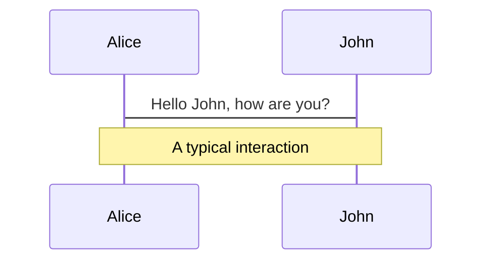
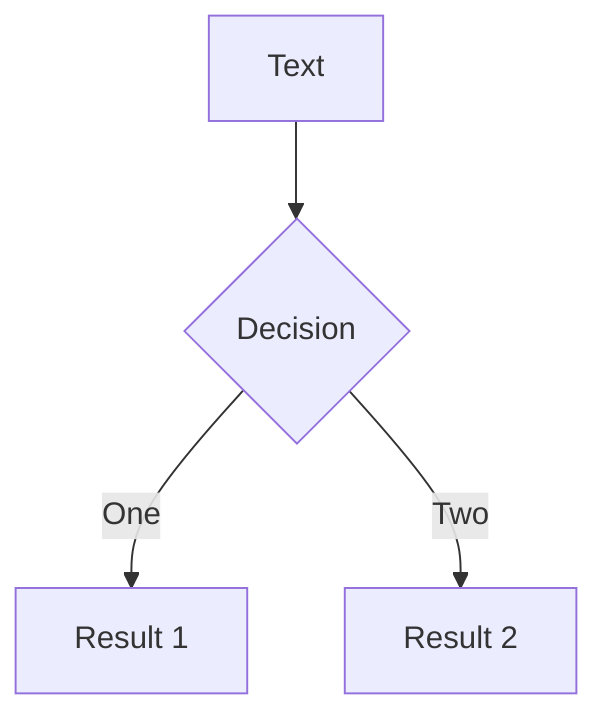

---
# try also 'default' to start simple
theme: default
# random image from a curated Unsplash collection by Anthony
# like them? see https://unsplash.com/collections/94734566/slidev
colorSchema: light
layout: cover
# apply any windi css classes to the current slide
class: text-center
monaco: true 
fonts:
  # basically the text
  sans: 'Roboto Condensed'
# https://sli.dev/custom/highlighters.html
highlighter: shiki
# some information about the slides, markdown enabled
info: |
  ## ©Master Thesis by Nils Jorek
---

# Machine Learning for Safer Smart Environments

### Exploration and Evaluation of Reinforcement
### Learning for Time Series Anomaly Detection


<Bar title="A thesis by Nils Jorek" cover/>


<!--
The last comment block of each slide will be treated as slide notes. It will be visible and editable in Presenter Mode along with the slide. [Read more in the docs](https://sli.dev/guide/syntax.html#notes)
-->

---

# Agenda

or today's lunch

<br>
<br>

1. 📝 **Introduction** - why are we interested in this topic
2. 📡 **State of the Art** - how far goes current/past research
3. 🔎 **Objectives** - without objectives there's no goal
4. 🧠 **Problem Model** - brain power's needed here
5. ⌨️ **Design & Implementation** - computer scientists love this part
6. 🥼 **Experiments & Results** - did we actually achieve something
7. 🛠 **Conclusion & Outlook** - on the future of anomaly detection


<Bar title="Machine Learning for Safer Smart Environments" logo/>


---
layout: two-cols
preload: false
---

<template v-slot:default>

# Introduction

why are we interested in this topic

<div grid="~ cols-2 gap-2" m="-t-3">


</div>
<br>
<br>
<br>
<br>

- interdisciplinary research area 
- young in terms of contribution
- safety critical systems
- thrives through machine learning
- how cross-domain can ML algorithms be
- reinforcement learning outside of the box
  
</template>
<template v-slot:right>


<div v-motion-pop>
  
</div>
<div class="source ml-18">
<p class="text-xs text-white">crawled from https://en.wikipedia.org/wiki/Anomaly_detection</p>
</div>

<Bar title="Machine Learning for Safer Smart Environments"/>
</template>

<style>
.source{
  transform: translatey(-50px);
}
</style>
---
---
# State of the Art
how far goes current/past research

<br>
<br>

- interesting, but off-topic
  - <MyModal titleModalHook="hyperparameter optimization with reinforcement learning" imageUri="./sota1.png"></MyModal>
  - <MyModal titleModalHook="network intrusion detection based on MDPs" imageUri="./sota2.png"></MyModal>
  - <MyModal titleModalHook="hypothetical anomaly detection framework for sensor networks" imageUri="./sota3.png"></MyModal>
  - <MyModal titleModalHook="expert support system for optimal database queries" imageUri="./sota4.png"></MyModal>
- interesting, and on timeseries
  - <MyModal titleModalHook="inverse reinforcement learning on trajectory data" imageUri="./sota5.png"></MyModal>
  - <MyModal titleModalHook="deep q-learning anomaly detection framework" imageUri="./sota6.png"></MyModal>
  - <MyModal titleModalHook="asynchronous actor critic anomaly detection" imageUri="./sota7.png"></MyModal>
  

<Bar title="Machine Learning for Safer Smart Environments"/>

---
layout: image-right
image: https://source.unsplash.com/collection/94734566/1920x1080
---

# Code

Use code snippets and get the highlighting directly!

<!-- https://sli.dev/guide/syntax.html#line-highlighting -->

```ts {all|2|1-6|9|all}
interface User {
  id: number
  firstName: string
  lastName: string
  role: string
}

function updateUser(id: number, update: User) {
  const user = getUser(id)
  const newUser = {...user, ...update}  
  saveUser(id, newUser)
}
```

<arrow v-click="3" x1="400" y1="420" x2="230" y2="330" color="#564" width="3" arrowSize="1" />
---
layout: none
---

# 

<Plotly
 link="//plotly.com/~jorekai/1.embed"/>

---
class: px-20
---

# Themes

Slidev comes with powerful theming support. Themes are able to provide styles, layouts, components, or even configurations for tools. Switching between themes by just **one edit** in your frontmatter:

<div grid="~ cols-2 gap-2" m="-t-2">

```yaml
---
theme: default
---
```

```yaml
---
theme: seriph
---
```


</div>

Read more about [How to use a theme](https://sli.dev/themes/use.html) and
check out the [Awesome Themes Gallery](https://sli.dev/themes/gallery.html).

---
preload: false
---

# Animations

Animations are powered by [@vueuse/motion](https://motion.vueuse.org/).

```html
<div
  v-motion
  :initial="{ x: -80 }"
  :enter="{ x: 0 }">
  Slidev
</div>
```

<div class="w-60 relative mt-6">
  <div class="relative w-40 h-40">
    
    
    
  </div>

  <div 
    class="text-5xl absolute top-14 left-40 text-[#2B90B6] -z-1"
    v-motion
    :initial="{ x: -80, opacity: 0}"
    :enter="{ x: 0, opacity: 1, transition: { delay: 2000, duration: 1000 } }">
    Slidev
  </div>
</div>

<!-- vue script setup scripts can be directly used in markdown, and will only affects current page -->
<script setup lang="ts">
const final = {
  x: 0,
  y: 0,
  rotate: 0,
  scale: 1,
  transition: {
    type: 'spring',
    damping: 10,
    stiffness: 20,
    mass: 2
  }
}
</script>

<div
  v-motion
  :initial="{ x:35, y: 40, opacity: 0}"
  :enter="{ y: 0, opacity: 1, transition: { delay: 3500 } }">

[Learn More](https://sli.dev/guide/animations.html#motion)

</div>

---

# LaTeX

LaTeX is supported out-of-box powered by [KaTeX](https://katex.org/).

<br>

Inline $\sqrt{3x-1}+(1+x)^2$

Block
$$
\begin{array}{c}

\nabla \times \vec{\mathbf{B}} -\, \frac1c\, \frac{\partial\vec{\mathbf{E}}}{\partial t} &
= \frac{4\pi}{c}\vec{\mathbf{j}}    \nabla \cdot \vec{\mathbf{E}} & = 4 \pi \rho \\

\nabla \times \vec{\mathbf{E}}\, +\, \frac1c\, \frac{\partial\vec{\mathbf{B}}}{\partial t} & = \vec{\mathbf{0}} \\

\nabla \cdot \vec{\mathbf{B}} & = 0

\end{array}
$$

<br>

[Learn more](https://sli.dev/guide/syntax#latex)

---

# Diagrams

You can create diagrams / graphs from textual descriptions, directly in your Markdown.

<div class="grid grid-cols-2 gap-4 pt-4 -mb-6">





</div>

[Learn More](https://sli.dev/guide/syntax.html#diagrams)


---
layout: center
class: text-center
---

# Learn More

[Documentations](https://sli.dev) / [GitHub Repo](https://github.com/slidevjs/slidev)